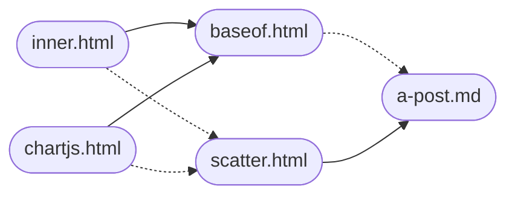

+++
title = 'template customization 3'
date = 2024-10-15T07:19:55+07:00
draft = false
tags = ['bug2', 'hugo', 'shortcodes', 'partials']
authors = ['viridi']
url = '24j26'
+++
Third theme customization of a new Hugo site following initial setting.

<!--more-->

It is an advancement of previous customizations, e.g. [template customization 2](../24j17/) and [template customization 1](..//24j15/).

1. Modify `layouts/_default/baseof.html` by adding following lines at the end in the `<header> .. </header>` block.
    ```
    {{ if .HasShortcode "blank/scatter" }}
      {{ partial "script/inner.html" . }}
      {{ partial "script/chartjs.html" . }}
    {{ end }}
    ``` 
2. Create `layouts/partials/script/chart.js` with following content.
    ```
    <script>
    function datasets4Scatter(series) {
      var datasets = [];
      var N = series.length;
      for(let i = 0; i < N; i++) {
        var ds = {
          data: B_SERIES[i],
          label: B_SLABEL[i],
          backgroundColor: B_PCOLOR[i],
          showLine: B_LVISIB[i],
          borderColor: B_LCOLOR[i],
          pointRadius: B_PRADII[i]
        };
        datasets.push(ds);
      }
      return datasets;
    }
    </script>
    ```
3. Create `layouts/partials/script/inner.js` with following content.
    ```
    <script>
    function getEOL(text) {
      let eol = '\r\n';
      if(text.indexOf(eol) == -1) eol = '\r';
      if(text.indexOf(eol) == -1) eol = '\n';
      return eol
    }

    function block2lists(b, eol) {
      let x = [];
      let y = [];
      
      let lines = b.split(eol);
      for(let row of lines) {
        let col = row.split(',');
        x.push(col[0]);
        y.push(col[1]);
      }
      return [x, y];
    }

    function block2data(b, eol) {
      let d = [];
      
      let lines = b.split(eol);
      for(let row of lines) {
        let col = row.split(',');
        let obj = {
          x: col[0],
          y: col[1]
        };
        d.push(obj);
      }
      return d;
    }

    function getBlocks(text, eol) { 
      let lines = text.split(eol);
      lines.shift();
      lines = lines.join(eol);
      blocks = lines.split(eol + eol);
      return blocks;
    }

    function cleanPrePostBlankLines(text) {
      let inner = text;
      let eol = getEOL(inner);
      let lines = inner.split(eol);
      
      if(lines[0].length == 0) lines.shift();
      let N = lines.length;
      if(lines[N-1].length == 0) lines.pop();
      
      return lines;
    }

    function getParams(t) {
      let eol = getEOL(t);
      let lines = t.split(eol);
      
      for(let l of lines) {
        let cols = l.split(' ');
        if(cols[0] == 'B_LVISIB') {
          let temp1 = cols[1].split(',');
          let temp2 = []
          for(let i = 0; i < temp1.length; i++) {
            if(temp1[i] == 'true') {
              temp2.push(true);
            } else {
              temp2.push(false);
            }
            temp2.push(Boolean(temp1[i]));
          }
          window[cols[0]] = temp2;
        } else {
          window[cols[0]] = cols[1].split(',');
        }
      }
    }

    </script>
    ```
4. Create `layouts/shortcodes/scatter.html` with following content.
    ```
    {{ $w := default "80" (.Get 0) }}
    {{ $h := default "300" (.Get 1) }}
    {{ $r := ( .Inner | chomp) }}
    {{ $seed := "foo" }}
    {{ $id := delimit (shuffle (split (md5 $seed) "" )) "" }}

    <div style="width: {{ $w }}%; height: {{ $h }}px; margin: 0 auto">
        <canvas id="{{ $id }}"></canvas>
    </div>


    <script>
    var r = {{ ( .Inner | chomp) }};
    var eol = getEOL(r);
    var blocks = getBlocks(r, eol);
    var params = getParams(blocks.shift());
    var B_SERIES = [];
    for(b of blocks) {
      var d = block2data(b, eol);
      B_SERIES.push(d);
    }
    </script>

    <script src="https://cdn.jsdelivr.net/npm/chart.js@4.4.1/dist/chart.umd.min.js"></script>
    <script type="text/javascript">
        var ctx = document.getElementById('{{ $id }}')
          .getContext('2d');
        
        var config = {
          type: 'scatter',
          data: { datasets: datasets4Scatter(B_SERIES) },
          options: {
            responsive: true,
            maintainAspectRatio: false,
            scales: {
              x: {
                type: 'linear',
                position: 'bottom',
                title: {
                  display: true,
                  text: B_XLABEL
                }
              },
              y: {
                title: {
                  display: true,
                  text: B_YLABEL
                }
              }
            }
          }
        };
        
        new Chart(ctx, config);
    </script>
    ```
Partials named `inner.html` and `chartjs.html` is included explicitly in `baseof.html`, which is template for `a-post.md`. Shortcodes named `scatter` (in `scatter.html`) is called inside `a-post.md`, where it requires `inner.html` and `chartjs.html`.



In above figure explicit inclusion uses solid line arrow (&rarr;) while implicit inclussion uses dashed line arrow (&#8674;).
