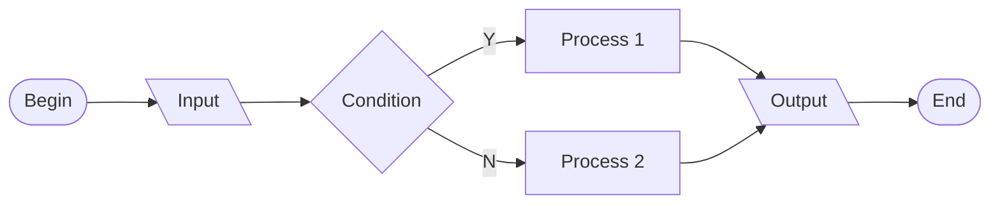

+++
title = 'sk5010 rbl w-rep 1'
date = 2024-11-15T12:29:55+07:00
draft = false
tags = ['slide']
authors = ['viridi']
url = '24k08'
+++
SK5010 Visualization in Science Research-Based Learning weekly report 1 in 2024-1 semester.

<!--more-->

Info:

+ SK5010 RBL weekly report 1: A progress report
  - url https://osf.io/t96na
  - version 20241115_v0
+ Outline
  - Intro 3
  - Ahmad Zaini Zahrandika 9
  - Arvin Cansius 12
  - Ilona Joan Manuela 15
  - Ariansyah 18
  - Gerend Christopher 21
  - Marco Sutisna Putra 24
  - Kahfi Rizky Kosasih 27
  - Closing 30

Sketch:



```
```mermaid
flowchart LR
B --> I --> C --"Y"--> P1
C --"N" --> P2
P1 & P2 --> O --> E
B([Begin])
I[\Input\]
C{Condition}
P1[Process 1]
P2[Process 2]
O[\Output\]
E([End])
` ``
```
