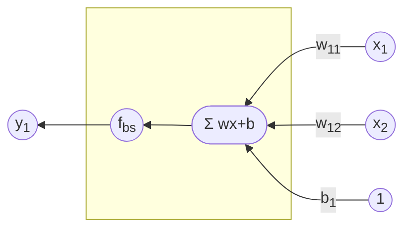
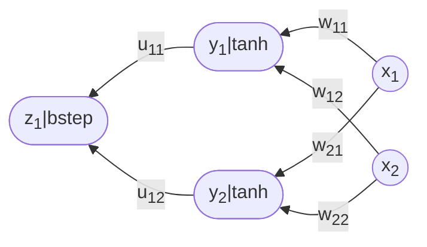

+++
title = 'futher intro perceptron'
date = 2024-11-18T05:01:57+07:00
draft = false
math = true
tags = ['slide']
authors = ['viridi']
url = '24k11'
+++
Feed forward and learning algorithms as further intro to single-layer perceptron.

<!--more-->

Info:

+ Further intro to perceptron: Datasets generation, classification, andlearning
  - url https://osf.io/9vxfz
  - version 20241119_v7
+ Outline
  - Intro 3
  - Linear separable dataset generation 6
  - Feed forward in single-layer perceptron 23
  - Binary classification ability 29
  - Decision boundary line 47
  - Learning process 60
  - Error estimation 76
  - Additional topic as intermezzo 91
  - Closing 98

Sketch:

$$\tag{1}
f(x) = \left\\{
\begin{array}{lr}
1, & x \ge 0, \newline
0, & x < 0.
\end{array}
\right.
$$

$$\tag{2}
ax + by + c = 0.
$$

$$\tag{3}
z_1 = w_{11} x_1 + w_{12} x_2 + b_1
$$

$$\tag{4}
y_1 = f_{\rm bs}(z_1)
$$

$$\tag{5}
y_1 = f\left(
\left[
\begin{array}{ccc}
w_{11} & w_{12} & b_1
\end{array}
\right]
\left[
\begin{array}{c}
x_1 \newline
x_2 \newline
1
\end{array}
\right]
\right)
$$

$$\tag{6}
x^{n+1}_i = y^{n}_i
$$

$$\tag{7}
x_i^{n+1} = f^n\left(
\left[
\begin{array}{ccc}
w_{ij}^n & w_{ij}^n & b_i^n
\end{array}
\right]
\left[
\begin{array}{c}
x_j^n \newline
x_j^n \newline
1
\end{array}
\right]
\right)
$$

$$\tag{8}
w_{11} x_1 + w_{12} x_2 + b = 0.
$$

$$\tag{9}
x_2 = - \left(\frac{w_{11}}{w_{12}}\right) x_1 - \left(\frac{b}{w_{12}}\right).
$$

$$\tag{10}
{\rm SSE} = \sum_{i = 1}^n (y_i - \hat{y}_i)^2.
$$

$$\tag{11}
{\rm MCE} = \frac{1}{n} \sum_{i = 1}^n \delta(y_i,\hat{y}_i).
$$

$$\tag{12}
\delta(a, b) = \left\\{
\begin{array}{cc}
1 & a = b, \newline
0 & a \ne b.
\end{array}
\right.
$$

